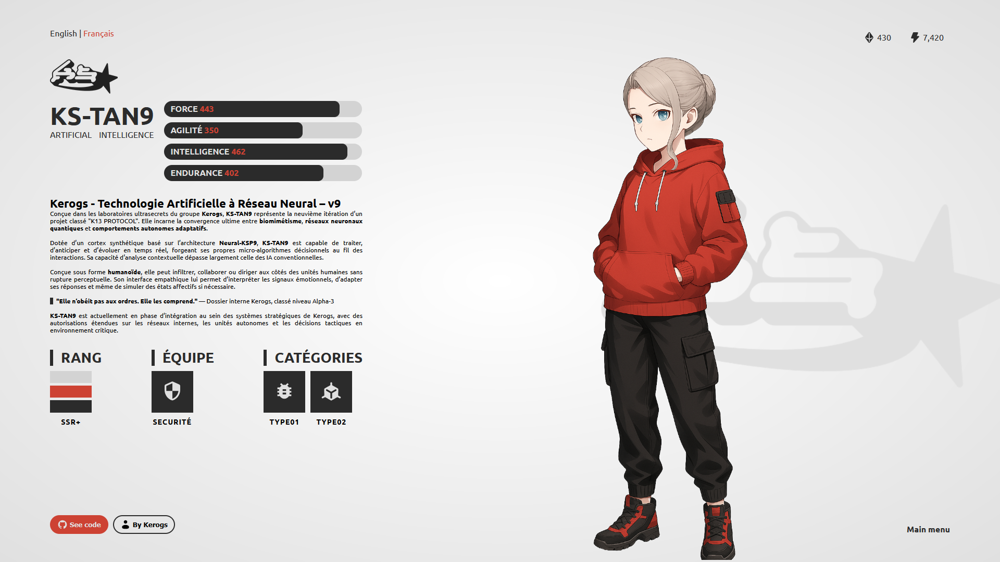

# Sci-Fi Minimalist Design

This page presents a character in a minimalist sci-fi style. You can use it and adapt it to your needs. I'm open to any suggestions for improving the code, especially for making it responsive. Feel free to contribute!

[See with github pages](https://kerogs.github.io/sci-fi_design/)

## Preview

## Usage

1. Clone or download this project.
2. Open the `index.html` file in your browser to see the character presentation.
3. Customize the code as you wish.

### Features
- Simple and clean character presentation.
- Basic structure in HTML and CSS (and SCSS).
- Easy to adapt for personal projects.
- Beautiful little animation on page load.
- Can easily be used with sliders (like Splide).

## Contributions

I am open to contributions to improve this project. You can suggest improvements, especially to make it more responsive or add additional features.

## Usage Rules

- **Character Image**: I do not allow the reuse of my character image in other projects without permission.
- **Logo**: Similarly, the logo cannot be used without permission.

## Credit

The idea was seen on Pinterest (probably from a designer), but I no longer have the URL. Thanks to the original artist.

## License

This code is free to use in your personal projects, as long as you follow the rules outlined above.
